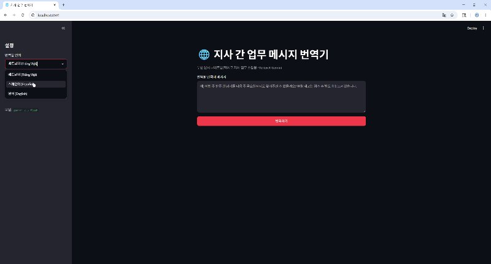

# 지사 간 업무 메시지 번역기

한국 지사와 해외 지사(베트남·멕시코) 간 업무 메시지를 번역하는 작은 도구입니다.
Vertex AI의 Gemini 모델을 사용하며, 제조업 업무 용어집을 프롬프트에 주입해
"발주·납기·견적" 같은 용어가 엉뚱하게 번역되는 문제를 막습니다.

> AI Native 개발자 사전 과제 제출물입니다.

## 시연 영상

[](https://github.com/HONG-SH-1/branch-message-translator/blob/main/video/demo.mp4)

## 핵심 기능

- 한국어 업무 메시지 → 베트남어 / 스페인어 / 영어 번역 (1개 핵심 기능)
- `업무 용어집 적용` 토글: 켜고/끄고 번역 품질 차이를 직접 비교 가능

## 실행 방법

### 1. 의존성 설치

```bash
pip install -r requirements.txt
```

### 2. Vertex AI 인증 (서비스 계정 JSON 키)

GCP 콘솔 → `IAM 및 관리자` → `서비스 계정` → 키 탭 → `키 추가` → `새 키 만들기` →
**JSON** 으로 다운로드. (해당 서비스 계정에 `Vertex AI User` 역할 필요)

### 3. 실행

다운로드한 JSON 키 경로를 환경 변수로 등록합니다. (한 번만, 등록 후 터미널 재시작)

```powershell
[Environment]::SetEnvironmentVariable("GOOGLE_APPLICATION_CREDENTIALS", "본인_키_경로.json", "User")
```

이후 실행:

```powershell
.\run.ps1
```

프로젝트 ID는 JSON 키에서 자동으로 읽습니다.

## 파일 구성

```
.
├─ src/
│  ├─ app.py           # Streamlit UI + Vertex AI 번역 로직
│  ├─ glossary.py      # 언어별 업무 용어집
│  └─ 품질테스트.py     # 번역 품질 검증 스크립트 (역번역·라운드트립)
├─ video/
│  ├─ demo.mp4         # 시연 영상
│  └─ thumbnail.jpg    # README 미리보기 썸네일
├─ requirements.txt    # 의존성
├─ run.ps1             # 실행 스크립트
└─ README.md
```

> AI 활용 기록·회고는 별도 문서(워드)로 제출합니다.
